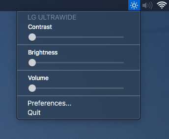
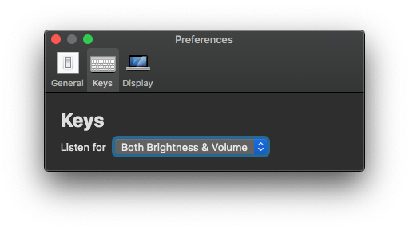
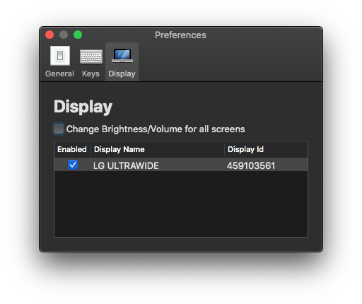
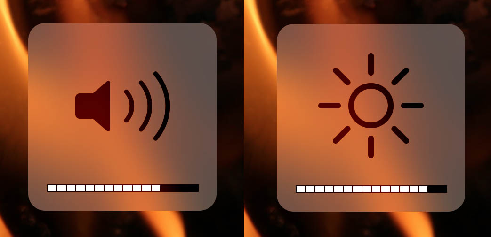

<h1 align="center"> MonitorControl </h1>

<!-- subtext -->
<div align="center">
Control your external monitor brightness, contrast or volume directly from a menulet or with keyboard native keys.
</div>

<br/>

<!-- shields -->
<div align="center">
    <!-- downloads -->
    <a href="https://github.com/JoniVR/MonitorControl/releases">
        
    </a>
    <!-- version -->
    <a href="https://github.com/JoniVR/MonitorControl/releases/latest">
        
    </a>
    <!-- license -->
    <a href="https://github.com/JoniVR/MonitorControl/blob/master/License.txt">
        
    </a>
    <!-- platform -->
    <a href="https://github.com/JoniVR/MonitorControl">
        
    </a>
</div>

<br/>

<div align="center">
    
    <br/><br/>
    

<br/>

*Bonus: Using keyboard keys displays the native osd*


</div>

## Download

Go to [Release](https://github.com/JoniVR/MonitorControl/releases/latest) and download the latest `.dmg`

## How to help

Open [issues](./issues) if you have a question, an enhancement to suggest or a bug you've found. If you want you can fork the code yourself and submit a pull request to improve the app.

## How to build

### Required

- Xcode
- [Cocoapods](https://cocoapods.org/)

Download the [zip](https://github.com/JoniVR/MonitorControl/archive/master.zip) directly or clone the project somewhere with git

```sh
$ git clone https://github.com/JoniVR/MonitorControl.git
```

Then download the dependencies with Cocoapods

```sh
$ pod install
```

You're all set ! Now open the `MonitorControl.xcworkspace` with Xcode

### Third party dependencies

- [MediaKeyTap](https://github.com/JoniVR/MediaKeyTap)
- [MASPreferences](https://github.com/JoniVR/MASPreferences)
- [ddcctl](https://github.com/kfix/ddcctl)
- [AMCoreAudio](https://github.com/rnine/AMCoreAudio)

## Support
- macOS Sierra (`10.12`) and up.
- Works with monitors comptaible with [@kfix/ddcctl](https://github.com/kfix/ddcctl)

## Thanks
- [@bluejamesbond](https://github.com/bluejamesbond/) (Original developer)
- [@Tyilo](https://github.com/Tyilo/) (Fork)
- [@the0neyouseek](https://github.com/the0neyouseek) (Fork)
- [@Bensge](https://github.com/Bensge/) - (Used some code from his project [NativeDisplayBrightness](https://github.com/Bensge/NativeDisplayBrightness))
- [@nhurden](https://github.com/nhurden/) (For the original MediaKeyTap)
- [@kfix](https://github.com/kfix/ddcctl) (For ddcctl)
